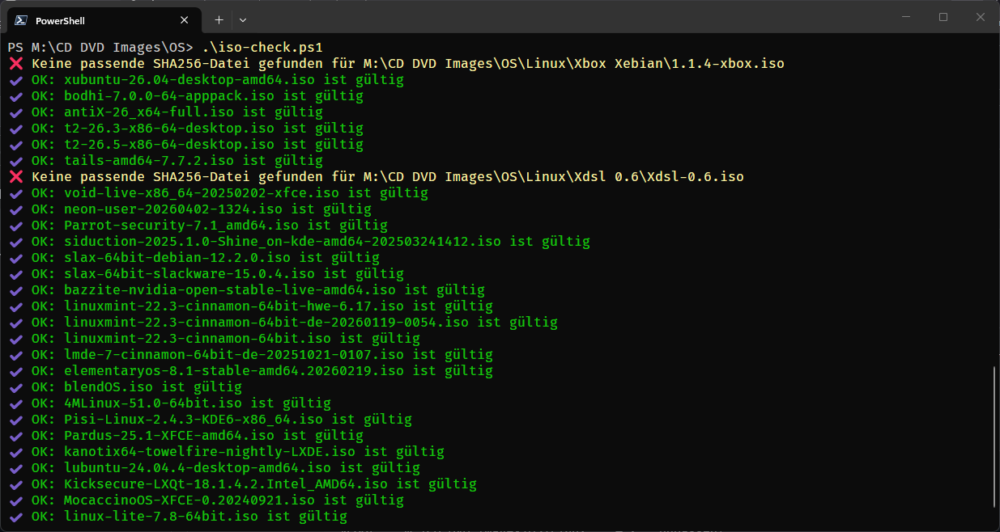

# iso-check #

A PowerShell script for verifying the integrity of ISO files

## What does this script do? ##

The script searches the specified folder for ISO files and checks whether an SHA256 file with the same identifier exists. It then calculates the checksum and compares it.

## Usage ##

Customize this line to suit your needs:
```
$root = "C:\Pfad\zu\ISO"   # <-- Anpassen!
```

Open a PowerShell console and type the following:
```
 .\iso-check.ps1
```
 to use the script.

## Screenshot ##


